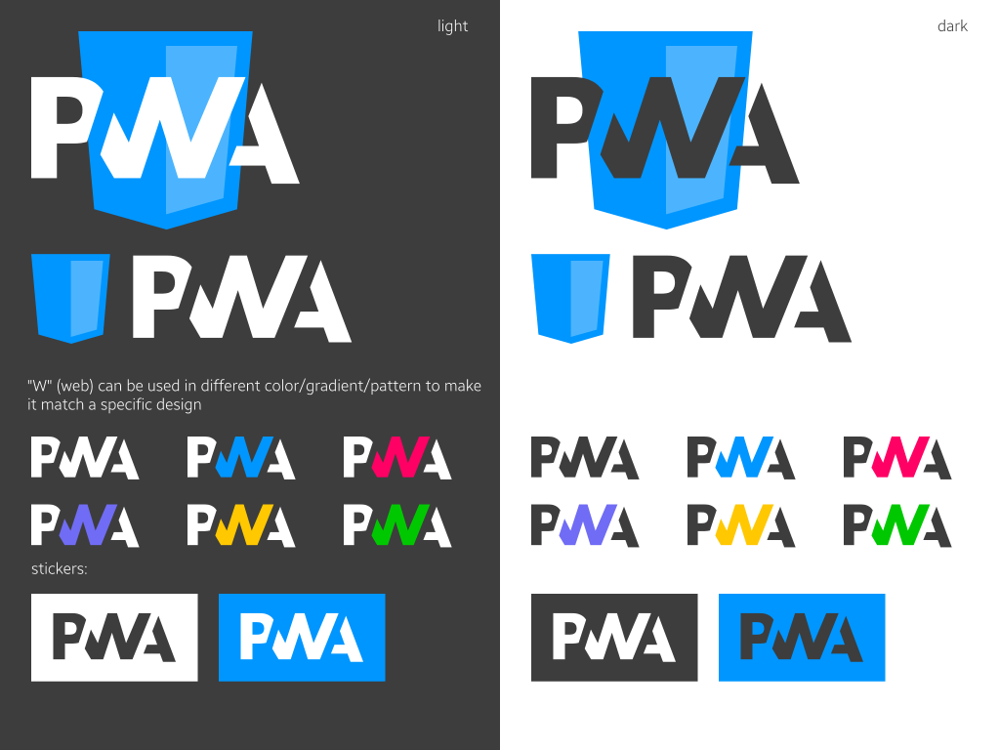

*This content is here only for the historical reasons. Check the voting here https://github.com/webmaxru/progressive-web-apps-logo/issues/3*

Progressive Web Applications (PWA) Logo By The Community
========================

This is just a proposal. Please feel free to contribute by posting the issues and/or sending pull requests.

# Tech Specs
- Color #2B50A3 + white
- Font [Roboto Bold](https://github.com/google/roboto/)

# Source
- [PWA Logo (Adobe Illustrator)](pwa-logo.ai)
- [PWA Logo (PostScript)](pwa-logo.eps)

# Contact
- [Maxim Salnikov](mailto:salnikov@gmail.com)

# Alternative Proposal - Josh Moont

# Tech Specs
- Base Color #2B50A3
- Light Base #7B97C9
- Grey #EEEEEE
- Light Grey / White #F6F9F8

# Source
- [PWA Logo (Adobe Illustrator)](proposal-joshm/pwa-logo.ai)
- [PWA Logo (PostScript)](proposal-joshm/pwa-logo.eps)
- [PWA Logo (SVG)](proposal-joshm/pwa-logo.svg)

# Contact
- [Josh Moont](mailto:moonty@gmail.com)

# Alternative Proposal - diekus

# Tech Specs
- white/#3D3D3D with optional colorful "W"

# Source
- [PWA Logo (SVG)](proposal-diekus/pwa_diekus.svg)

# Contact
- [diekus](mailto:diekus@gmail.com)
